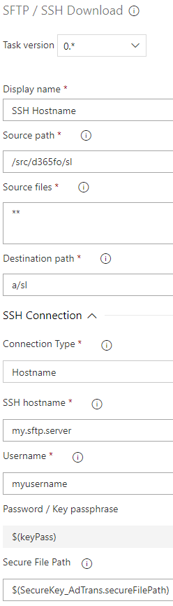

# Adacta SFTP / SSH Dowload
*Azure DevOps Pipelines Extension* for build and release pipelines.

## SFTP / SSH Download task
Download files from remote SSH connection via SFTP client to pipeline agent.

### Usage


### Parameters
- **Source files**: remote source path.  
Can be minimatch file pattern. [More Information](https://docs.microsoft.com/en-us/azure/devops/pipelines/tasks/file-matching-patterns?view=azure-devops)  
Example: `**`
- **Destination path**: agent local target path. May be source, artifact or any other local path.  
Example: `$(Build.SourcesDirectory)` (*defult working directory*), `$(Build.StagingDirectory)`

- *SSH Connection* - **Connection Type**:
  - **SSH Connection**: Select pipline service connection of type *ssh*.
  - **Hostname**: 
    
    - **SSH Hostname**: Host name or IP address of the remote machine with optional port.  
    Eexample: `sftp.company.com` or `hostname:22`
    
    - **Username**: Username / login.
    
    - **Password / Key passphrase**: Provide the password or the passphrase for the private key if using a keypair. Use secret variable.  
    Example: `$(sshPassword)`
    
    - **Secure File Path**: Filename of secure file. Use [Download Secure File](https://go.microsoft.com/fwlink/?LinkID=862069) task and set output variable name (`Reference name` under *Output Variables*).  
    Example: `$(SecureKey.secureFilePath)`

- *Advanecd*
  - **Clean target folder**: Delete all existing files and subfolders in the target folder before copying.
- *Output Variables*
  - **ProcessedFilesCount**: Number of processed files.

## YAML
*yaml* example:
```yaml
steps:
- task: adacta.azdevopsSFTP.task-sftp-download.sftpDownload@0
  displayName: 'SFTP Download'
  inputs:
    sourcePath: /src/d365fo/sl
    target: a/sl
    cleanTargetFolder: false
    connectionType: hostname
    sshHost: my.sftp.server
    username: myusername
    password: '$(Parameters.password)'
    secureFilePath: '$(SecureKey_AdTrans.secureFilePath)'
  ```

## Release Notes
> **1.1** *2019-03-11*
> * `Clean target folder` option added

> **1.0** *2019-03-01*
> * Initial version (`preview`)


